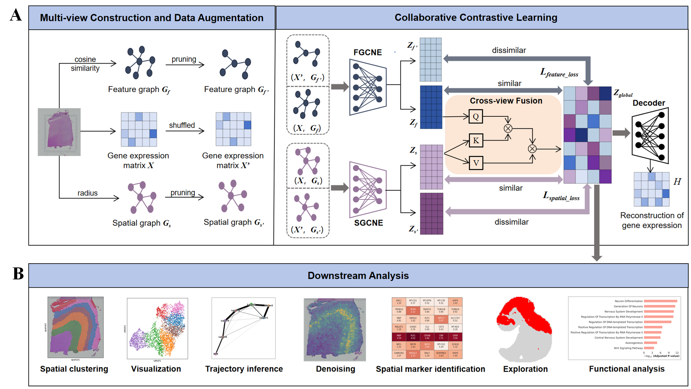

stCCL: collaborative contrastive learning with global shared representation for spatial domains identification

Overview

stCCL, a collaborative contrastive learning model for spatial transcriptomics data. Combining gene perturbation with topological random pruning, stCCL constructs more discriminative contrastive views. stCCL dynamically fuses spatial and feature views to generate a global representation, constraining the contrastive learning process and achieving multi-view collaborative optimisation during training.  Experimental results demonstrate that stCCL achieves superior performance in identification accuracy and biological interpretability compared to seven state-of-the-art methods. Furthermore, stCCL precisely identifies fine-grained tissue domains and enhances the spatial expression patterns of genes. It further deciphers potential spatial marker genes, explores unlabeled regions, and facilitates downstream functional analysis.